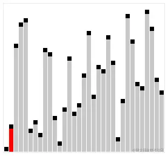

---
head:
  - - link
    - rel: stylesheet
      href: https://cdnjs.cloudflare.com/ajax/libs/KaTeX/0.5.1/katex.min.css
---
# Insertion Sort 插入排序

## 1. 算法描述

`插入排序`（Insertion Sort）是一种简单直观的、稳定的原址比较排序算法。大致思路是将数据结构分为已排序区间和未排序区间，每次从未排序区间中取出一个元素，将其插入到已排序区间中的合适位置，直到未排序区间为空。时间复杂度为 $O(n^2)$，空间复杂度为 $O(1)$。

## 2. 动图演示



## 3. 代码实现

### 3.1 JavaScript 实现

<<< ./insertion-sort.js

### 3.2 TypeScript 实现

<<< ./insertionSort.ts

## 4. 使用示例

```js
import insertionSort from './insertion-sort.js';

const arr = [5, 2, 4, 6, 1, 3];
insertionSort(arr);
console.log(arr); // [1, 2, 3, 4, 5, 6]

const arr1 = [{a: 1}, {a: 3}, {a: 2}, {a: 5}, {a: 4}];
insertionSort(arr1, (a, b) => a.a > b.a);
console.log(arr1); // [{a: 1}, {a: 2}, {a: 3}, {a: 4}, {a: 5}]
```

## 5. 速度测试

::: tip
数组长度过大，网页可能会崩溃哦，请量力而行！
:::
<script setup>
import SortExample from './sort.vue'
</script>

<SortExample />

::: details 测试代码
<<< ../component/baseSort.vue
:::
