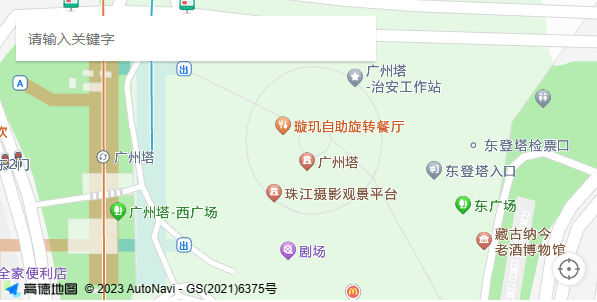

# VueAMap 地图

二次封装的vue-amap的地图组件。支持搜索、定位、标记等功能。改变选中后，抛出地址、经纬度等信息。该组件包大小过大，且不好用，建议使用其他库。

::: details 组件源码
<<< ../../../../apps/src/components/SMap/index.vue
:::

## 基本用法

1. 先在main.ts中引入并注册`VueAMap`组件，如下：

```ts
import VueAMap, { initAMapApiLoader } from '@vuemap/vue-amap'
import '@vuemap/vue-amap/dist/style.css'

// 去高德地图开发者平台申请key
initAMapApiLoader({
  key: '',
  securityJsCode: ''
})

const app = createApp(App)
app.use(VueAMap)
```

1. 在vue组件中引入`SMap`组件，如下：

```vue
<template>
  <s-map @changeAddress="onChangeAddress" />
</template>

<script lang="ts">
import SMap from '...'

const onChangeAddress = (address: string) => {
  console.log(address)
}
</script>
```

## 效果


