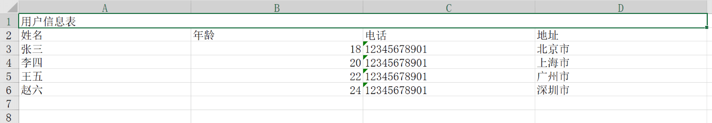
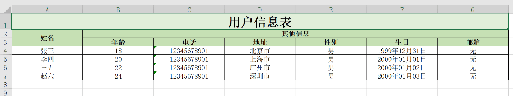

# ExcelJS

针对Excel文件生成的封装，提供更友好的配置，减低上手难度。[ExcelJS 官方中文文档](https://github.com/exceljs/exceljs/blob/HEAD/README_zh.md)。

::: details 实现源码
<<< ../../../../packages/utils/src/plugins/excel.ts
:::
::: details downloadFile
<<< ../../../../packages/utils/src/plugins/downloadFile.ts
:::

## 安装

需要安装 `exceljs` 和 `file-saver` 依赖。

```bash
pnpm add exceljs file-saver
pnpm add @types/file-saver -D
```

## 基本使用

### 1. 简单示例

  
配置如下：
```ts
import { type IConfig, createExcelFile } from '...';

const onDownloadSimple = () => {
  const config = {
    fields: ['name', 'age', 'phone', 'address'],
    // 第一行为表头，合并4个单元格
    merges: [{ row: 1, col: 1, rowspan: 0, colspan: 3 }],
    data: [
      { name: '张三', age: 18, phone: '12345678901', address: '北京市' },
      { name: '李四', age: 20, phone: '12345678901', address: '上海市' },
      { name: '王五', age: 22, phone: '12345678901', address: '广州市' },
      { name: '赵六', age: 24, phone: '12345678901', address: '深圳市' }
    ],
    headers: [['用户信息表'], ['姓名', '年龄', '电话', '地址']],
    sheetName: '用户信息表',
    columnsWidth: Array.from({ length: 4 }, () => 30)
  };

  createExcelFile(config).then((buffer) => {
    downloadFile(buffer!, '用户信息表.xlsx');
  });
};
```

### 2. 复杂示例



配置如下：
```ts
import { type IConfig, createExcelFile } from '...';

const onDownloadMulti = () => {
  const fields = ['name', 'age', 'phone', 'address', 'sex', 'birthday', 'email'];
  const config: IConfig = {
    fields,
    data: [
      { name: '张三', age: 18, phone: '12345678901', address: '北京市', sex: '男', birthday: new Date('2000/01/01'), email: '无' },
      { name: '李四', age: 20, phone: '12345678901', address: '上海市', sex: '男', birthday: new Date('2000/01/02'), email: '无' },
      { name: '王五', age: 22, phone: '12345678901', address: '广州市', sex: '男', birthday: new Date('2000/01/03'), email: '无' },
      { name: '赵六', age: 24, phone: '12345678901', address: '深圳市', sex: '男', birthday: new Date('2000/01/04'), email: '无' }
    ],
    attrs: [],
    headers: [
      ['用户信息表'],
      ['姓名', '其他信息'],
      ['', '年龄', '电话', '地址', '性别', '生日', '邮箱']
    ],
    merges: [
      // 显示标题 '用户信息表'，合并第一行所有单元格
      { row: 1, col: 1, rowspan: 0, colspan: fields.length - 1 },
      // 显示表头 '姓名'，合并第二行与第三行的第一个单元格
      { row: 2, col: 1, rowspan: 1, colspan: 0 },
      // 显示表头 '其他信息'
      { row: 2, col: 2, rowspan: 0, colspan: 5 }
    ],
    sheetName: '用户信息表-复杂表头',
    columnsWidth: Array.from({ length: fields.length }, () => 20)
  };

  config?.fields?.forEach((item, index) => {
    if (item === 'age') {
      // 设置整数格式
      config?.attrs?.push({
        rowStart: 4,
        rowEnd: config.data.length + 3, // 表头占用三行
        colStart: index + 1, // 索引从0开始，列从1开始，所以加1
        colEnd: index + 1,
        attr: {
          numFmt: '#,##0'
        }
      });
      return;
    }

    if (item === 'birthday') {
      // 设置日期格式
      config?.attrs?.push({
        rowStart: 4,
        rowEnd: config.data.length + 3,
        colStart: index + 1,
        colEnd: index + 1,
        attr: {
          numFmt: 'yyyy"年"mm"月"dd"日"'
        }
      });
      return;
    }
  });

  // 设置单元格样式
  config?.attrs?.push({
    rowStart: 1,
    rowEnd: config.data.length + 3,
    colStart: 1,
    colEnd: config?.fields?.length,
    attr: {
      alignment: { vertical: 'middle', horizontal: 'center' },
      border: {
        top: { style: 'thin' },
        left: { style: 'thin' },
        bottom: { style: 'thin' },
        right: { style: 'thin' }
      }
    }
  });

  // 设置表头标题样式
  config?.attrs?.push({
    rowStart: 1,
    rowEnd: 1,
    colStart: 1,
    colEnd: config?.fields?.length,
    attr: {
      fill: {
        type: 'pattern',
        pattern: 'solid',
        fgColor: { argb: 'e2efda' }
      },
      font: {
        size: 20,
        bold: true
      }
    }
  });

  // 设置表头填充颜色，字体加粗
  config?.attrs?.push({
    rowStart: 2,
    rowEnd: 3,
    colStart: 1,
    colEnd: config?.fields?.length,
    attr: {
      fill: {
        type: 'pattern',
        pattern: 'solid',
        fgColor: { argb: 'c6e0b4' }
      },
      font: {
        bold: true
      }
    }
  });

  createExcelFile(config).then((buffer) => {
    downloadFile(buffer!, '用户信息表-复杂表头.xlsx');
  });
};
```
